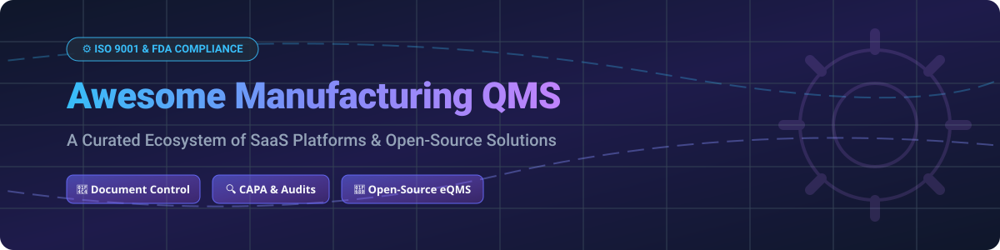

# 🏭 Awesome Manufacturing Quality Management System (QMS) 🚀

  
  
  
  

## 📌 Overview & Top Quality Management System (eQMS) Ecosystem

A curated list of enterprise **SaaS eQMS Platforms** and **Open-Source Quality Management Systems** tailored for discrete manufacturing, life sciences, medical devices, and pharmaceutical compliance.

Key focus areas include: **Controlled Document Management**, **Corrective and Preventive Actions (CAPA)**, **Change Control**, **Employee Training Records**, **Internal & Supplier Audits**, **Nonconformance Management (NC)**, and compliance standard enforcement (**ISO 9001**, **ISO 13485**, **FDA 21 CFR Part 11**, and **FDA QMSR**).

---

## 📊 Market Overview & Industry Dynamics

> 💡 **Market Size & Structure:** The Global Enterprise Quality Management System (eQMS) market is estimated at **$10.5 Billion - $12.8 Billion** (2026), expanding at a CAGR of **~10.2%**. The manufacturing quality software sector is **moderately fragmented**, featuring high-valuation enterprise suite consolidators (such as Honeywell/Sparta, PTC/Arena, Hexagon/ETQ, and Veeva) operating alongside specialized life-science eQMS platforms and agile open-source solutions.

---

## 🏢 SaaS/Hosted eQMS Platforms

Below is a comparison of top SaaS Quality Management Systems sorted by **Company Size / Valuation / Revenue (Descending)**.

| SaaS Product 🏭 | Company Size / Valuation / Revenue 💰 | Specific Pricing 🏷️ | Free Tier / Trial Limit ⏳ | Key Features & Compliance 📋 |
| :--- | :--- | :--- | :--- | :--- |
| **[Veeva QualityOne](https://www.veeva.com/)** | Market Cap >$20 Billion+ (Veeva Systems total rev ~$3B+) | Custom quote (Enterprise contracts typically start at $50,000+/year) | No free tier; No public free trial (Personalized demo available) | Cloud QMS within Veeva Vault ecosystem for document control, risk, and supplier quality in regulated manufacturing. |
| **[MasterControl](https://www.mastercontrol.com/)** | $1.3 Billion Valuation (Series A) / ~$200M+ ARR | Starts at $25,000 per year (Base platform custom tier) | No free tier; No self-service free trial (Free live demo on request) | Enterprise manufacturing execution & quality suite for life sciences, document control, and CAPA. |
| **[Sparta TrackWise](https://www.honeywell.com/)** | Acquired for $1.3 Billion (Honeywell) | TrackWise Digital base floor starts at ~$200/user/month ($2,400/user/yr) | No free tier; No free trial (Sales demo available) | Enterprise deviation, CAPA, change control, and 21 CFR Part 11 complaint management. |
| **[Arena QMS (PTC)](https://www.ptc.com/)** | Acquired for $715 Million (PTC) | Starts at $1,200 - $2,500 per user/year (Min annual contract ~$10,000) | No free tier; Limited pilot/interactive demo available on request | Product lifecycle management (PLM) seamlessly integrated with quality management. |
| **[Intelex](https://www.intelex.com/)** | Acquired for $570 Million (Fortive) | Safety Essentials tier starts at $44/user/month (Min 25 users = $13,200/yr) | No free tier; 14-day evaluation / demo pilot by request | EHS & quality management platform covering audits, nonconformance, and supplier risks. |
| **[ETQ Reliance](https://www.etq.com/)** | Acquired by Hexagon (Enterprise Division) | Custom quote (Typical enterprise floor starts at ~$15,000+/year) | No free tier; No free trial (Executive demo available) | Flexible quality management across discrete manufacturing, automotive, and aerospace. |
| **[Greenlight Guru](https://www.greenlight.guru/)** | Estimated $25,000 - $60,000+ annual deployment range | Starts at ~$25,000 per year (Core package fee) | No free tier; No free trial (Medtech product demo available) | Purpose-built medical device eQMS aligned with ISO 13485 & FDA QMSR. |
| **[Qualio](https://www.qualio.com/)** | ~$22 Million ARR | Base platform starts at ~$12,000 per year | No free tier; No free trial (Guided software demo available) | Modern eQMS designed for life-science and medtech startups to manage documents and CAPA. |
| **[Qualtrax](https://www.qualtrax.com/)** | Acquired for ~$14.9 Million (Ideagen) | Custom quote (Base enterprise packages starting around $8,000+/year) | No free tier; No free trial (Custom pilot arranged upon contact) | ISO 17025 compliance, document control, audit management, and automated workflows. |
| **[QT9 QMS](https://qt9software.com/)** | Estimated ~$4.5 Million ARR | Starts at ~$120/user/month or ~$2,200 per concurrent user/year | No free tier; **14-Day Free Trial** available with sample data | All-in-one quality management with 25+ modules including inspection & training. |

---

## 💻 Open-Source GitHub Projects

These open-source solutions allow organizations to run self-hosted or version-controlled Quality Management workflows. Listed in order of **GitHub_Stars (Descending)**.

- **[Odoo Quality Module](https://github.com/odoo/odoo)**   
  Comprehensive open-source ERP quality suite with quality control points, inspection checks, and nonconformance alerts integrated directly into manufacturing operations.

- **[ERPNext Quality Management](https://github.com/frappe/erpnext)**   
  Built-in ERPNext quality management module covering Quality Goals, Quality Procedures, Inspection criteria, and Action Items for production lines.

- **[n8n Workflow Automation for Quality Pipelines](https://github.com/n8n-io/n8n)**   
  Fair-code workflow engine used to automate document approval notifications, CAPA triggers, and audit compliance logging across web services.

- **[Documenso (Document Signing & Approvals)](https://github.com/documenso/documenso)**   
  Open-source digital signature alternative for compliant SOP document sign-offs, authorization chains, and audit trails.

- **[FormKiQ Core (Document & Records Management)](https://github.com/FormKiQ/formkiq-core)**   
  Headless document management system (DMS) tailored for enterprise document control, retention policies, and compliance record storage.

- **[OpenQMS](https://github.com/C-realize/OpenQMS)**   
  Lightweight open-source eQMS web application providing controlled document approval, training assignments, and change tracking under AGPL license.

- **[QAtrial](https://github.com/MeyerThorsten/QAtrial)**   
  AI-assisted open-source quality management prototype for regulated medical devices and pharmaceutical CAPA tracking.

- **[Open-eQMS](https://github.com/dromation/open-eqms)**   
  Community project creating an open-source enterprise Quality Management System standard and framework.

---

## 🛠️ Open-Source Implementation Strategies

1. **ERP-Integrated QMS**: Utilize **Odoo** or **ERPNext** quality apps when quality checks must interface with bill of materials (BOM), work orders, and inventory lots.
2. **Git-Native / Open QMS**: Use Git-based pull requests and markdown workflows for lightweight SOP versioning, document approvals, and change control.
3. **Automated Compliance Triggers**: Combine **FormKiQ** for controlled record archives with **n8n** for routing CAPA deviations to engineering teams.

> ⚠️ **Regulatory Note:** While open-source frameworks provide operational transparency and low upfront cost, regulated manufacturers (FDA/ISO 13485) remain responsible for validating software against 21 CFR Part 11 and Annex 11.

---

## 🤝 How to Contribute

Contributions are always welcome! 

1. **Fork** the repository 🍴
2. **Create** your feature branch (`git checkout -b feature/qms-tool`) 🌿
3. **Commit** your changes (`git commit -m 'Add new QMS platform'`) 💬
4. **Push** to the branch (`git push origin feature/qms-tool`) 🚀
5. **Open** a Pull Request 📩

---

## ☕ Support & Sponsorship

If you find this repository helpful for evaluating Quality Management Systems or building your manufacturing stack, please consider supporting the project!

- ⭐ **Star** this repository to help others discover it!
- 🔀 **Fork** it to keep your own curated reference.
- 📣 **Share** it with quality managers and compliance engineers.
- 💖 **Buy me a coffee / Sponsor**: Support ongoing maintenance on the [GitHub Sponsor Dashboard](https://github.com/sponsors/ishandutta2007).

---

## 📈 Star History

---

## ⚖️ Disclaimer

- This is a community-curated list and does not constitute formal legal, regulatory, or compliance advice.
- Always consult qualified regulatory experts before deploying software in GxP or ISO-certified manufacturing environments.
